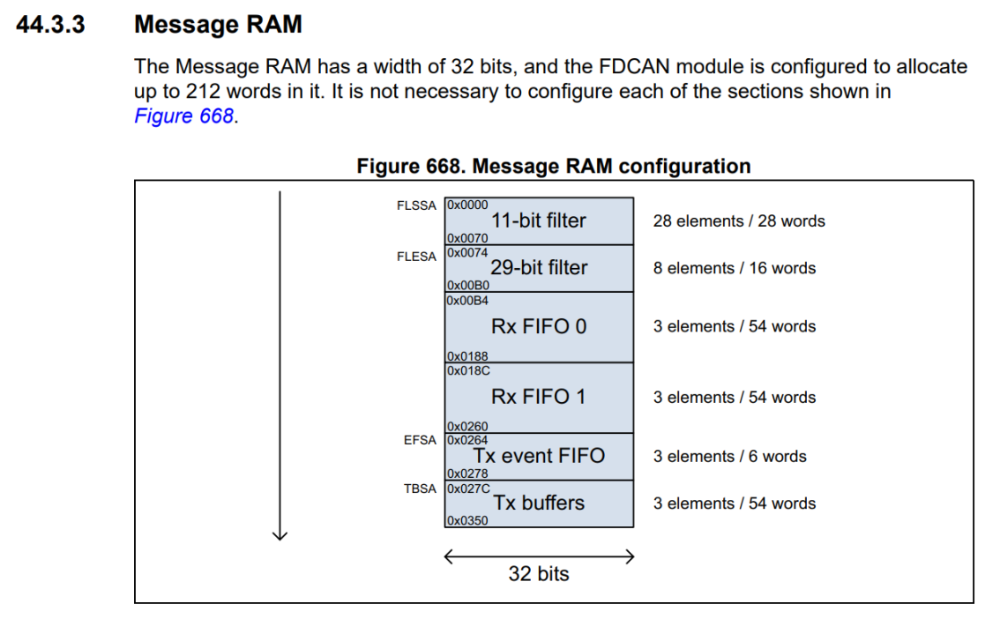
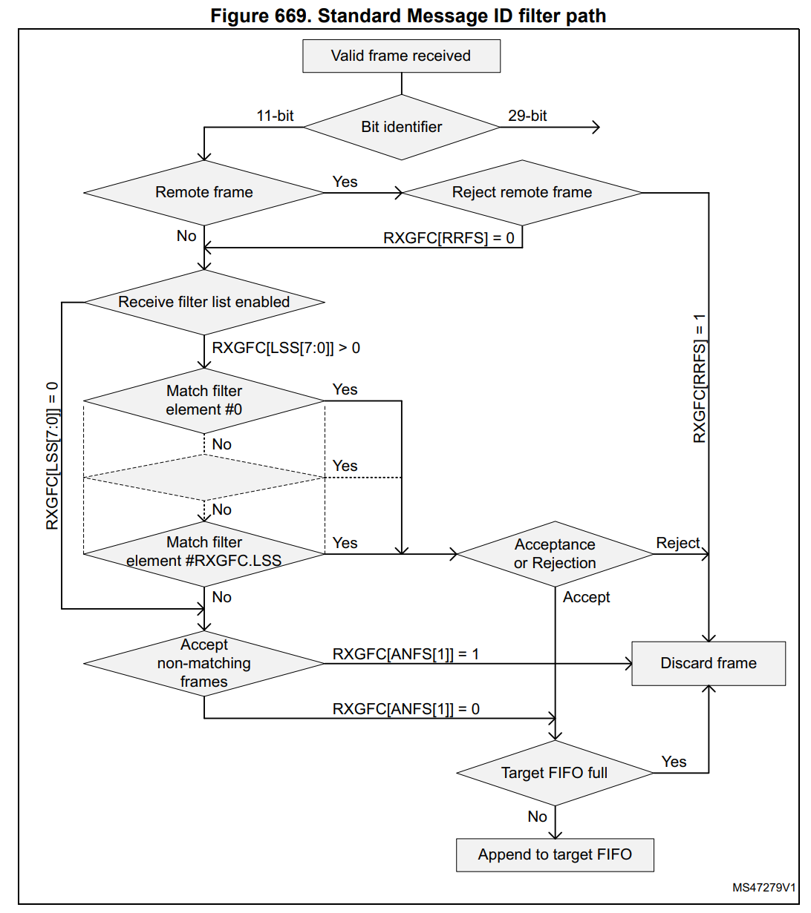
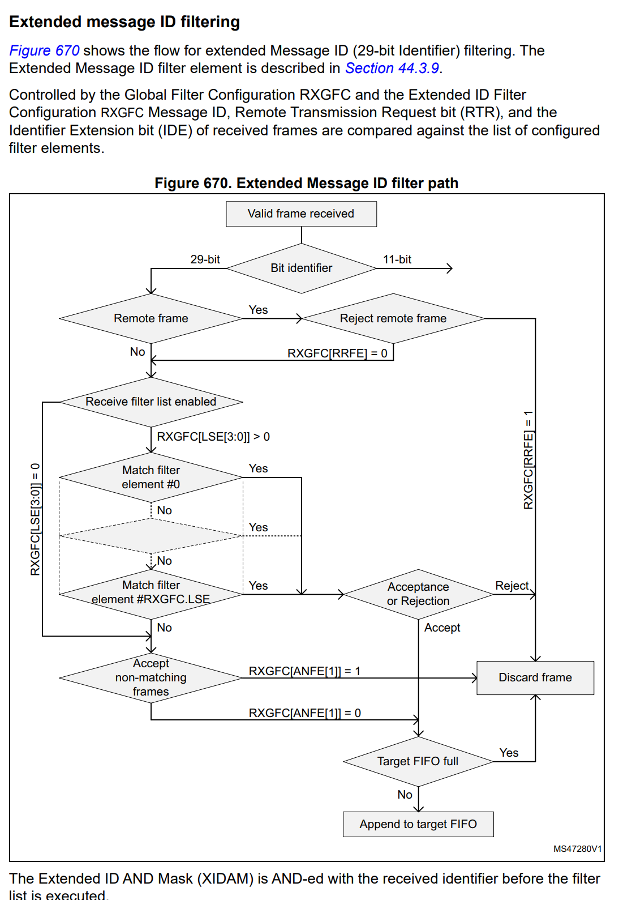
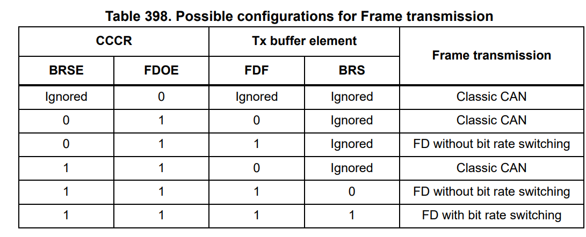

# Hal INIT

  Exit from sleep via FDCAN_CCCR_CSR
  Poll for sleep mode ack FDCAN_CCCR_CSA
  Request Init by setting FDCAN_CCCR_INIT
  Poll for init mode ack FDCAN_CCCR_INIT
  Enable config change FDCAN_CCCR_CCE
  Set CKDIV
  Configure peripheral:
  - retransmission FDCAN_CCCR_DAR
  - pause FDCAN_CCCR_TXP
  - exception handling FDCAN_CCCR_PXHD
  - frame format FDCAN_FRAME_FD_BRS
  - test mode FDCAN_CCCR_TEST | FDCAN_CCCR_MON | FDCAN_CCCR_ASM
  - loopback FDCAN_TEST_LBCK
                | Normal | Restricted |    Bus     | Internal | External
                |        | Operation  | Monitoring | LoopBack | LoopBack
      CCCR.TEST |   0    |     0      |     0      |    1     |    1
      CCCR.MON  |   0    |     0      |     1      |    1     |    0
      TEST.LBCK |   0    |     0      |     0      |    1     |    1
      CCCR.ASM  |   0    |     1      |     0      |    0     |    0
  - NOTE: Writing to TEST requires enabling TEST in CCCR
  Set bit timing FDCAN_NBTP_*
  If data bit timining is needed, set FDCAN_DBTP_*
  Set FIFO queue via TXBC
  Calculate FDCAN RAM configuration
  - TODO(timmay): Do these have to be aligned?
  - Total: 3k, shared between all three FDCAN periphs
    - Can do 1k/1k/1k, 2k/512/512, etc
  - Starting location based on CAN1/2/3 as CAN_SRAM_START + (ID-1)*CAN_SRAM_SIZE
  - Number of filter elements RXGFC and FDCAN_RXGFC_LSS
  - Extended filter elements RXGFC and FDCAN_RXGFC_LSE
  - RxFifo 0 start address RxFIFO0SA
  - RxFifo 1 start address RxFIFO1SA
  - Tx event Fifo start address TxEventFIFOSA
  - Tx event Fifo queue TxFIFOQSA
  - Finally, zero out memory.
  Init next buffer index to 0=
  - Note: Might be hal-specific?
  Configure filters:
  - Standard or extended
    - Configuration is different due to filter size differences!
  - filter index
  - Filter type
    - Range: filter from id1 to id2
    - Dual: filter id1 or id2
    - Mask: Classic filter: id1=filter, id2=mask
    - Range no EIDM: Same as range, but ignoring EIDM setting
  - Filter configuration
    - Disable
    - Filter to rxfifo0
    - Filter to rxfifo1
    - Reject id if filter matches
    - High priority if filter matches
    - Filter to rxfifo0 high piority
    - Filter to rxfifo1 high piority
  - Configure global filter RXGFC
    - Usually:
      - Filter all remote frames with STD and EXT ID
      - Reject non matching frames with STD ID and EXT ID
  Start FDCAN module
    - Leave init FDCAN_CCCR_INIT
    - This just starts the FDCAN interface?
  Optionally enable interrupts
    - Might be better to do before init?
    - Configure interrupt line 1 or interrupt line 2 ILE
      - Interrupts on either line catch all signals, identified by bits in_____:
        - RX Fifo0
        - RX Fifo1
        - Status message (?)
        - TxFifo Error
        - Misc (?)
        - Bit line error
        - Protocol error
    - Maybe enable tx buffer transmission interrupt TXBTIE
    - Maybe enable tx buffer cancellation interrupt TXBCIE
    - Enable interrupts IE
    - Don't forget to wire up interrupts and handlers in NVIC!
  
  ### Some solid info on protocol error handling on P1951

  ## Other notes
  - FDF and BRS bits in CAN frame are ignored if FDOE is set to 0
    - BRSE - Enable bit rate switching, only enabled if FDOE is set
  - DLC codes 0-8 indicate length of data in standard CAN
    - DLC codes 9-15 have different meaning in FDCAN
    - Not uniform, 9-15 are 12,16,20,24,32,48, and 64 respectively
  - Bit rate switching in Fast Frames is controlled by timing/prescalar bits in
    FBTP
    - Not actually a register...?
    - I think it's part of the Bosch M_CAN controller. Not sure why it's
      referenced in ST's documentation...?
    - Guessing it's related to the data rate register
  - Oof. 22.2 uA/MHz. Think about lowering the clock by using PLLQ/8 (4?)
  - Look into DBTP.TDC: transmitter delay compensation
  - Restricted mode is receive-only, and does not do dominant bits in error or
    overload conditions.
    - Restricted mode is entered when TxHandler was not able to read data from
      the message RAM in time.
    - To clear, must reset CCCR.ASM
  - Can disable automatic retransmission (DAR)
  - Messages can be timestamped
    - Timer is prescaled TSSC.TCP
      - Multiples of CAN bit times, NOT clock cycles!
    - Read via RXTS or TXTS
  
  # Message SRAM
  - 212 words, addressable at 32-bit words (NOT bytes)
    - i.e. only bits 15-2 are evaluated (first two are ignored)
  - Consecutive in memory
    - FDCAN2 = final address of FDCAN1 + 4

  # Acceptance filters
  - Two sets: one for standard, one for extended
    - Individually assigned to Rx FIFO0 and/or RxFIFO1
  - Filters applied in order (from element 0)
    - Early exit criteria for matches
  - Filter has three types:
    - Range fileter (from-to)
    - Filter for one or two dedicated IDs
    - Classic bit mask filter
  - Filter configurable for acceptance or rejection
  - Enabled individually
  Relevant registers:
  - Global: `RXGFC`
  - Extended ID AND Mask (`XIDAM`)
  Filter configuration (`SFEC`/`EFEC`) triggers one of the following
  - Store in F0 or F1
  - Reject
  - Set high priority `IR[HPM`]
  - Set high priority `IR[HPM]` and store in F0 or F1
  Acceptance triggers immediately on identifier complete
  - Starts writing received signal directly in Fn if match
    - 32 bit writes at a time
  - On CRC error, writing is stopped/discarded
    - Put index is not updated
      - Old Rx FIFO Put index is overwritten with received data
    - For error type check `PSR.LEC` and `PSR.DLEC`
    - FIFO Overwrite mode, has to be considered, if enabled
  Range filter
  - Message ID determined by `SF1ID`/`SF2ID` and `EF1ID`/`EF2ID`
    - MessageID in [`SF1ID`, `SF2ID`] for standard
    - MessageID in [`EF1ID`, `EF2ID`] if EFT=00
    - MessageID & `XIDAM[EIDN]` in [`EF1ID`, `EF2ID`] if EFT=11
  - Two possibilities when using extended frames
    - `EFT=00`: message ID of _received_ frame is AND-ed with XIDAM before filter
      is applied
    - `EFT=11`: XIDAM not used
  Dedicated IDs
  - For specific message, filter must set xFID1=xFID2
  Classic bit mask
  - Single bit masking; akin to Range filtering with XIDAM but single messages
    (no range)
  - xF1ID is used as Message ID filter, while xF2ID is used as filter mask

# Rx FIFOs

- FIFO 0 and FIFO1 can hold up to three elements each
- RX FIFO full condition `IR[RFnF]`
  - No more message written until at least one has been read, and the Rx FIFO
    Get Index has been incremented
  - If another message comes in while full, it's dropped and `IR[RFnL]` (Lost?)
- When reading, Rx FIFO Get `RXFnS[FnGI]` + FIFO Element Size has to be added to
  the corresponding Rx FIFO start address `[FnSA]`
- Blocking mode
  - Default mode `RXGFC.FnOM=0`
  - Blocks (drops) until message read out and Get Index
  - Full signal `RXFnS.FnF`=1 
    - Interrupt `IR.RFnF` is set
- Overwrite mode
  - RXGFC.FnOM=1
  - Same fulil signal
  - Next message is written, both put and get are incremented by one
    - Message obviously lost
  - If full, reading must start at get index + 1
    - A received message can start to be written at Put while cpu is reading
      from Get
  - After reading from Rx FIFO, number of last element read has to be written to
    Fifo Acknowledge Index `RXFnA.FnA`
    - Increments the get index to that element number.
    - Can trigger Full condition `RXFnS.FnF` if Get=Put

# Tx handling

- Controls Put, Get, Event FIFO
- Up to three TxBuffers can be set up
- Message data field is configured to 64 bytes, Tx FIFO allocates eighteen 32
  bit words per Tx element
- 
- Handler starts Tx scan for highest priority pending Tx request (lowest ID)
  - When Tx buffer Request Pending is updated `TXBRP`
  - Or when a transmission has been startd
- Transmit pause
  - Useful when IDs are permanent
  - `TXP` bit in `CCCR`
  - Pauses for two can bit times before starting next transmission
    - Allows hardcoded lower priority message to go through
  - Mitigates "babbling idiot" scenarios
  
# Tx FIFO

- Configured by programming `TXBC[TFQM]` to 0
- Messages transmitted starting with message referenced by Get Index
  `TXFQS[TFGI]` 
  - After each transmission, Get is incremented cyclically until Tx FIFO empty
- Can enable transmission of message with same Message ID from different Tx
  buffers
  - In order they're written to TxFIFO
- Tx FIFO Free Level `TXFQS[TFFL]`
  - Difference between put and get
- Messages need to be written to appropriate Put index `TXFQS[TFQPI]`
  - Add Request increments Put 
  - If Put == Get, FIFO FULL `TXFQS[TFQF]=1`
- Transmit requested by writing `TXBAR`
  - For one message, write 1
  - For n messages, write n
    - Can't be higher than number of free buffers `TXFQS[TFFL]`
- When transmission referenced by Get is canceled, Get incremented 
  - Any others, Get and FIFO Free unchanged
- Tx allocates eighteen 32-bit words in MRAM
  - Start address of the next (free) TxFIFO is 4* Put `TXFQS[TFQPI](0...2)` to
    the Tx buffer Start addrress `TBSA`

# Tx Queue

- Configuration by programming `TXBC[TFQM]=1`
  - Queue operates by transmitting starting with the message with the lowest
    Message ID (highest priority)
  - Alternative to FIFO
  - When mixing standard and extended, bits `28:18` of extended are used
  - For multiple of the same, lowest idx is transmitted first
- New messages written to Put `TXFQS[TFQPI]
  - Add Request cyclically increments Put to next free Tx buffer
  - On queue full `TXFQS[TFQF]=1`, Put is not valid
    - No writes can be done
  - Can use register `TXBRP` instead of Put to place messages into any Tx buffer
  - Eighteen 32-bit words in MRAM
  - Start address of next available (free) Tx buffer is 4*Put
    `TXFQS[TFQPI](0...2)` to TxBuffer Start Address `TBSA`

# Transmit cancel

- Write 1 to corresponding buffer idx of `TXBCR`
  - Not inteded for Tx FIFO operation
  - Cancel confirmed by `TXBCF`
- Canceling in-flight
  - `TXBRP` stays set while in progress
  - If _transmit_ successful, `TXBTO` and `TXBCF` are set
  - If _transmit_ not successful, not repeated and only `TXBCF` are set

# Tx event handling

- Event FIFO
  - Message ID and timestamp are stored in Tx event FIFO
  - Message Marker from transmitted tx buffer is copied into the corresponding
    Tx event FIFO element 
- Three elements
- Decouple handling of transmit status from transmit message handling
  - Transmit status stored separately
- Event full at `IR[TEFF]`
  - Get needs to be incremented
  - On attempted update while full `IR[TEFL]` is set
- Reading needs 2xGet `TXEFS[EFGI]` to `EFSA`
